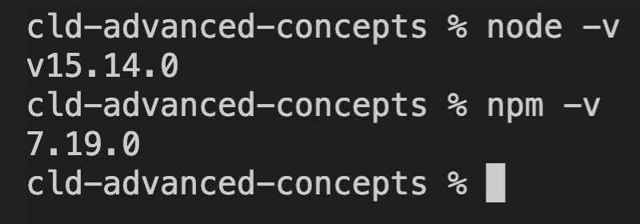

# Cloudinary Advanced Concepts 

This repository supports the Cloudinary Advanced Concepts course.  The course is designed to be run in workshop mode.  You can run all of the code locally using this repository.

## Create a free Cloudinary training account

You can create a new, free account on Cloudinary by adding +training to your
email when registering.  

Sign up [here](https://cloudinary.com/users/register/free)

For example, I can create an account with this email:
`My-GMail-account+training@cloudinary.com`  
Be sure to check your email to confirm your new account.

This is important, as we’ll be configuring settings and using Cloudinary add-ons.

## Code

The notes below will help you get setup to write and execute code.  We'll be using 

* node.js/npm
* html/css/javascript
* React
* Vue.js

## Node/NPM

Install the latest version of node.js/npm to follow along with node exercises.
[Download node.js and npm](https://nodejs.org/en/download/)  
 

You can update node/npm with this command: `npm i npm@latest -g` 

Your result should look something like this:
<div></div>

## The Vue.js CLI

We use a positioning app to experiment with transformation positioning. The app
is written in Vue.js.  If you want to run this app locally, you can install the Vue.js CLI.
  
Vue.js CLI Installation Instructions [here](https://cli.vuejs.org/)  

You will run install globally with this command: `npm install -g @vue/cli`.

**Note:** You’re not installing Vue.js globally, just a package with the CLI.

The will allow you to start a local server in the overlay-underlay/positioning-app directory:

```bash
npm run serve
```
You can all run this on the training server: [positioning app](https://cloudinary-training.github.io/cld-advanced-concepts/overlay-underlay/positioning-app/docs/index.html)

## IDE

We'll be using [Visual Studio Code](https://code.visualstudio.com/) to manage code in demos.

A text editor will work, but we recommend these IDE's for working with JavaScript as well:

* [Atom](https://atom.io/)
* [AWS Cloud 9](https://aws.amazon.com/cloud9/)
* [Brackets](http://brackets.io/)
* [WebStorm](https://www.jetbrains.com/webstorm/)
* [Sublime](https://www.sublimetext.com/)

## Setting up an HTTP Server

I’ll be using [Visual Studio Code](https://code.visualstudio.com/) with the [Live Server extension](https://marketplace.visualstudio.com/items?itemName=ritwickdey.LiveServer) to serve HTML files on localhost.  

Another alternative to using the VS Code live server extension is to install the npm http-server
```bash
npm i -g http-server
``` 
and open the server from the terminal with 
```
npx http-server
```

If you're using a Mac, you can use the built in python server
```bash 
python -m SimpleHTTPServer 8000
```


## Assets

This repo contains code and assets used for the course exercises.   The files can be served from `github.io`. This is useful when we’re working on modules like auto-upload/fetch where we need to fetch remote assets. For example: 
https://cloudinary-training.github.io/cld-advanced-concepts/assets/images/cc0.png.

You'll find media for images, video and raw (any file format besides images and video) in the assets directory. There is no specific security attached to the `secure-assets` directory. This is just a name to help with an exercise.

**(Optional)** If you want to serve your account repo on github.io, I recommend forking or
duplicating this repository into your own GitHub account. Forking allows you to pull from
upstream later if you want. Go to GitHub Settings and [set up gh pages](https://help.github.com/en/github/working-with-github-pages/configuring-a-publishing-source-for-your-github-pages-site) to serve the static HTML files and assets.  


## .env
Your `.env` file is `.gitignored ` and can’t be accidentally checked into a repository
because it will contain your `API_SECRET`.   

In the root of the project, you’ll find a `.env.template` file.
Copy it to an `.env` file and add your information: 
```bash
cp .env.template .env
```
This link will take you to the Console, where you can copy the Cloudinary 
URL into your buffer: https://www.cloudinary.com.

The .env file should contain the CLOUDINARY_URL and a USER_NAME which is the email you used to sign up for the account.

```bash
CLOUDINARY_URL=<cloudinary URL from console>
USER_NAME=<cloudinary account email>
```

## How to Run the node.js scripts 
 Before running any scripts you need to run `npm install` in the terminal in the directory containing the package.json.  

You may want to run `npm install` in all the subdirectories prior to starting the
course. This can guarantee you are ready if you are accessing the course in a
network where `npm install` may be blocked.
These are the directories that contain a package.json and need the `npm install`:

1. signing-widgets/bonus  
2. signing-widgets/server  
3. user-upload-workflow/remote-functions  
4. video-player/react
5. overlay-underlay/positioning-app 

All scripts (unless otherwise noted in a module) can be run from the root of the
project in the terminal.  

If I want to run a script in the `/access-control` directory to upload a private asset, I
can run it from the terminal like this from the root directory:
```bash
node access-control/private/upload-private.js
```

## Test your setup

Test that your environment variables are setup correctly:

```bash
node test-env.js
```

Test that you can upload assets:

```bash
node test-upload.js
``` 


We use the JavaScript React framework in the module on Video Player, as
questions come up about how to include widgets and player in frameworks. 
The code in the React example is very similar to what you would use in a static
HTML page. The code for Vue.js and Angular would be similar.  


## CDN and Browser Caching 

In this course, we’ll be concerned about browser caching and CDN caching.
Understanding the flow of requests through the CDN and into Cloudinary’s system storage will help. It’s also helpful to be able to identify if you are caching in the CDN and to eliminate browser caching. 

You can use the [Cloudinary Media Inspector](https://chrome.google.com/webstore/detail/cloudinary-media-inspecto/ehnkhkglbafecknplfmjklnnjimokpkg) to detect browser caching. 


To avoid browser caching, you can 
- check the disable cache and keep the chrome inspector open
- find an extension that prevents browser caching
- open your image requests incognito (Chrome) or private (Firefox)  

## gh pages settings

In github.com settings:
-- Choose master branch for the source.
-- Click Enforce HTTPS if you have the option available.
You can also serve assets from the training GitHub account: https://cloudinary-training.github.io/cld-advanced-concepts, for example https://cloudinary-training.github.io/cld-advanced-concepts/assets/images/dolphin.jpg. 


## VS Code Node debug  

VS Code Node Debug: optional
Simple breakpoint debugging
-- Enable Debug > Node: Auto Attach
-- Set breakpoints
-- In terminal `node --inspect <filename>`


## Cleanup 

If you want to remove all assets from your cloud that were uploaded in this course,
you can find cleanup scripts in the `/utils` directory


## Using prettier in VS Code

This repo uses prettier for formatting.  If you're using Visual Studio Code you can add the prettier extension.  You can also rename the `.prettierrc.suggest` to the hidden file `.prettier` to use the rules followed in formatting the code in this repo.
Contents of `.prettier` below


```
{
  "singleQuote": true,
  "tabWidth": 2,
  "semi": false,
  "arrowParens": "avoid",
  "space-before-function-paren": true
}
```